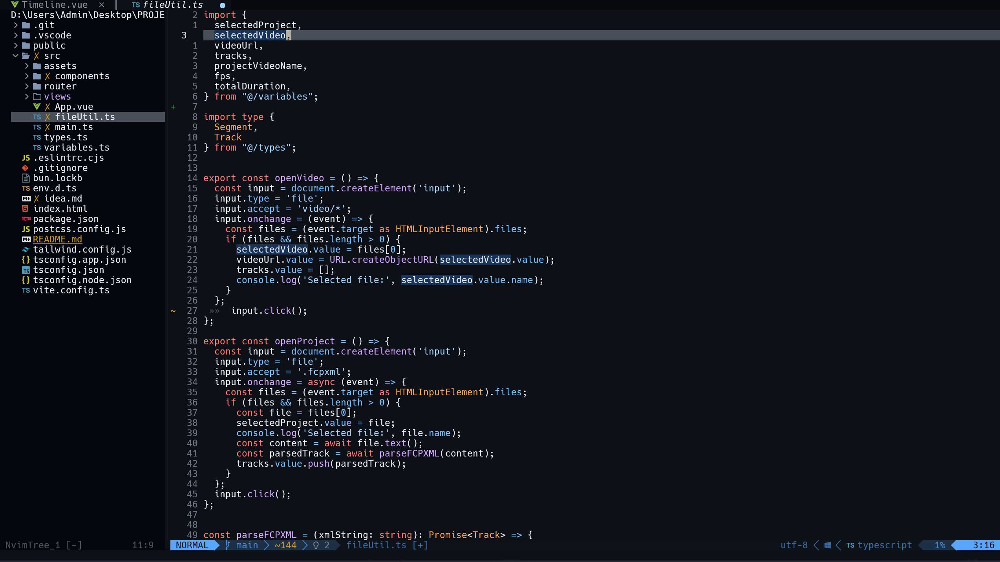

<div align="center">
  <h1>My Nvim lua configuration 💻 📄</h1>
  
</div>

---

## Setup

- Install [neovim](https://github.com/neovim/neovim/blob/master/INSTALL.md) for your current OS.
- Install [node & npm](https://nodejs.org/en).


##### Windows

```cmd
git clone https://github.com/KlevisImeri/nvim %USERPROFILE%\AppData\Local\nvim
npm install -g  @vue/typescript-plugin @vue/language-server typescript-language-server typescript neovim
nvim
```

```pwsh
git clone https://github.com/KlevisImeri/nvim $env:LOCALAPPDATA\nvim
npm install -g  @vue/typescript-plugin @vue/language-server typescript-language-server typescript neovim
nvim
```

##### Linux

```bash
git clone https://github.com/KlevisImeri/nvim ~/.config/nvim
npm install -g  @vue/typescript-plugin @vue/language-server typescript-language-server typescript neovim
nvim 
```

> [!ERROR]
> Don't use the linux branch is depricated

---

Then
```nvim
:Lazy
````
- `I` - for installing all plugins
- `U` - for updating them
- `S` - sync


> [!WARNING]
> Use `:checkhealth` to see what you what program you are missing and install them


---


## Plugins

##### Editor
- [beautiful tabs header](https://github.com/akinsho/bufferline.nvim)
- [comments](https://github.com/numToStr/Comment.nvim) 
- [gitsign](https://github.com/lewis6991/gitsigns.nvim)
- [indet-blankline](https://github.com/lukas-reineke/indent-blankline.nvim) -DEPRICATED
- [nice icons](https://github.com/nvim-tree/nvim-web-devicons)
- [beautiful bottom line](https://github.com/nvim-lualine/lualine.nvim)
- [file browser](https://github.com/nvim-tree/nvim-tree.lua)
- [todo comments](https://github.com/folke/todo-comments.nvim)
- [keybinds descriptor](https://github.com/folke/which-key.nvim)
- [auto adjust shiftwidth](https://github.com/tpope/vim-sleuth) -DEPRICATED

##### Search
- [General Searcher](https://github.com/nvim-telescope/telescope.nvim)
- [fzf file searcher](https://github.com/junegunn/fzf) -DEPRICATED
- [fzf-lua](https://github.com/ibhagwan/fzf-lua) -DEPRICATED

##### LSP
- [nvim lsp](https://github.com/neovim/nvim-lspconfig)
- [lanuage servers](https://github.com/williamboman/mason.nvim)
- [automatic lsp servers](https://github.com/williamboman/mason-lspconfig.nvim)
- [parser for color](https://github.com/nvim-treesitter/nvim-treesitter)
- [combined plugins](https://github.com/edubart/minilua)
- [autocompletion](https://github.com/hrsh6th/nvim-cmp)
- [autoformat](https://github.com/stevearc/conform.nvim)

##### Themes
- [githubtheme](https://github.com/projekt0n/github-nvim-theme) -DEFAULT
- [nightfly](https://github.com/bluz71/vim-nightfly-colors)
- [tokionight](https://github.com/folke/tokyonight.nvim)

##### Other
- [combined plugins](https://github.com/edubart/minilua)


> [!NOTE]
> DEFAULT := the one used by default
>
> DEPRICATED := I don't use it as a plugin anymore
